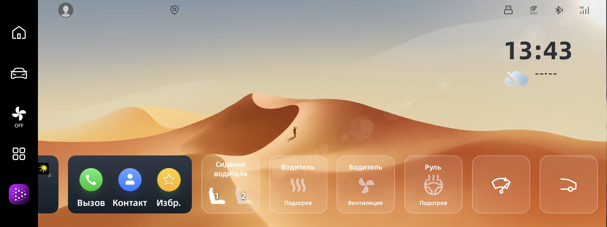
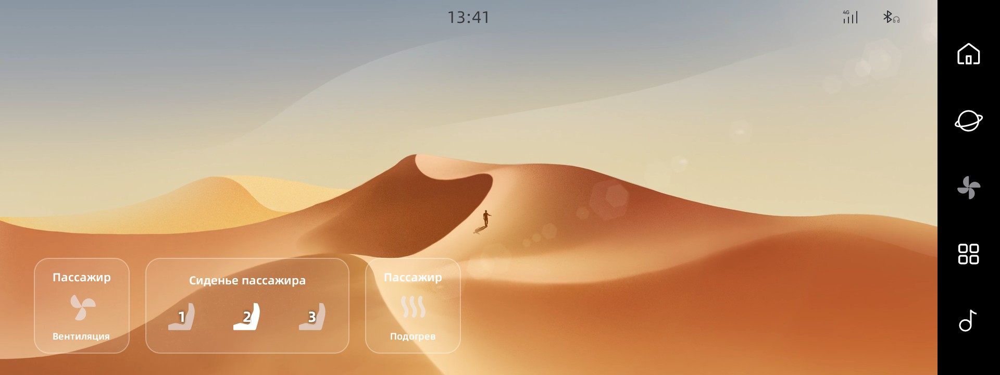
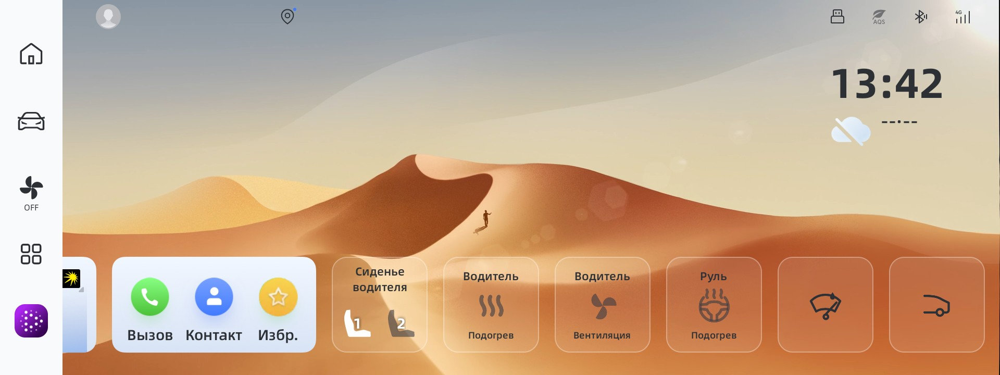
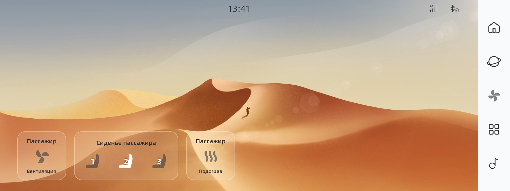
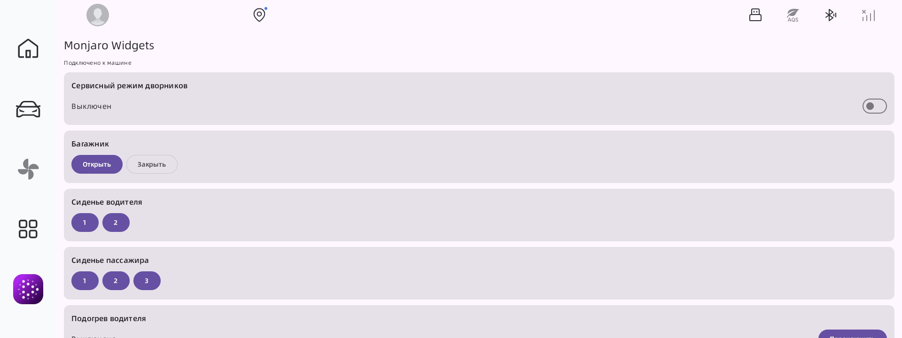
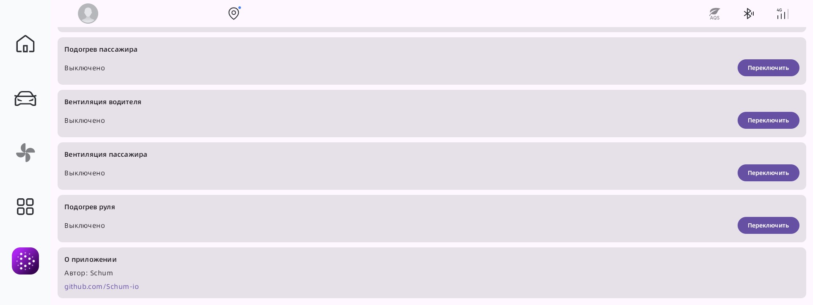

# Monjaro Widgets

Набор виджетов на главный экран для **Geely Monjaro (Рестайлинг, OS 2.0+)** —
управление функциями автомобиля одним нажатием через системный API ECARX.

> [!WARNING]
> Тестировалось на рестайлинговой Geely Monjaro. На дорестайлинге работоспособность
> не гарантируется. Виджеты поддерживаются с **OS 2.0**.

> [!NOTE]
> Виджеты можно установить на экран пассажира, при наличии приложения LSPosed

## Скриншоты

**Светлая тема**

| Центральный экран | Экран пассажира |
|:---:|:---:|
|  |  |

**Тёмная тема**

| Центральный экран | Экран пассажира |
|:---:|:---:|
|  |  |

**Экран приложения**

| Управление (1) | Управление (2) |
|:---:|:---:|
|  |  |

## Виджеты

| Виджет | Действие |
|---|---|
| **Сервисный режим дворников** | Перевод дворников в сервисное положение и обратно |
| **Багажник** | Открыть / закрыть|
| **Память сиденья водителя** | Вызов сохранённого профиля положения — 2 профиля |
| **Память сиденья пассажира** | Вызов сохранённого профиля положения — 3 профиля |
| **Подогрев сиденья водителя** | Цикл уровней OFF → 3 → 2 → 1 → OFF |
| **Подогрев сиденья пассажира** | Цикл уровней OFF → 3 → 2 → 1 → OFF |
| **Вентиляция сиденья водителя** | Цикл уровней OFF → 3 → 2 → 1 → OFF |
| **Вентиляция сиденья пассажира** | Цикл уровней OFF → 3 → 2 → 1 → OFF |
| **Подогрев руля** | Цикл уровней OFF → 3 → 2 → 1 → OFF |

Иконки виджетов отражают текущее состояние/уровень. Состояние синхронизируется в
реальном времени: если поменять функцию через штатное меню, иконка на виджете
обновится (фоновый сервис подписан на изменения свойств машины).

В приложении есть экран-хаб, дублирующий все функции виджетов.

## Установка приложения

1. Собрать или скачать `app-debug.apk` (см. «Сборка» ниже).
2. Установить в систему автомобиля (через ADB или менеджер файлов с root):
   ```bash
   adb install app-debug.apk
   ```
3. Добавить нужные виджеты на главный экран через стандартное меню виджетов
   (долгое нажатие на главном экране → виджеты → Monjaro Widgets).
4. Нажатие на виджет выполняет действие; иконка показывает состояние.

## Экран пассажира (LSposed-модуль)

По умолчанию виджеты можно разместить только на главном экране (водителя).
Системный лаунчер `oneOS_Launcher3` фильтрует виджеты пассажирского экрана по
жёстко зашитому whitelist, поэтому добавить туда сторонний виджет штатно нельзя.

Модуль **`psd-widget-module`** (Xposed/LSposed) обходит это: хукает
`XMLParseUtils.getWidgetWhiteList` лаунчера и добавляет в список пассажирского
экрана наши виджеты — **память, подогрев и вентиляцию сиденья пассажира**.

### Установка модуля
Требуется root + установленный **LSposed** (в прошивке GMC 2.0 присутствует Magisk/LSposed).

1. скачать `psd-widget-module.apk` и установить:
   ```bash
   adb install psd-widget-module-debug.apk
   ```
2. Открыть **LSposed Manager** → Модули → включить «Monjaro PSD Widgets».
3. В области действия (scope) модуля отметить лаунчер **`oneOS_Launcher3`**
   (пакет `com.android.launcher3`).
4. Перезагрузить Головное Устройство.
5. На экране пассажира открыть меню виджетов — появятся пассажирские виджеты.

## Архитектура (кратко)

- `:glycar-api` — stub ECARX API (`com.ecarx.xui.adaptapi.*`), подключается
  `compileOnly`; реальная реализация даётся системой машины в рантайме.
- `com.geely.os.car.GlyCar` — мост к API: чтение/запись свойств и подписка на изменения.
- `core/` — общие базы виджетов: `ToggleCarWidgetProvider` (переключатели),
  `CycleLevelWidgetProvider` (циклы уровней), `CarProperties` (id свойств/зон/значений),
  `CarStateService` (фоновая синхронизация состояния).
- `widget/` — конкретные виджеты (wipers, trunk, seat, climate).
