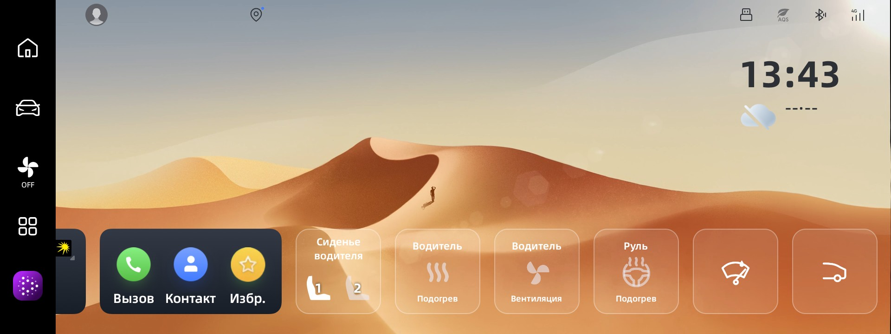
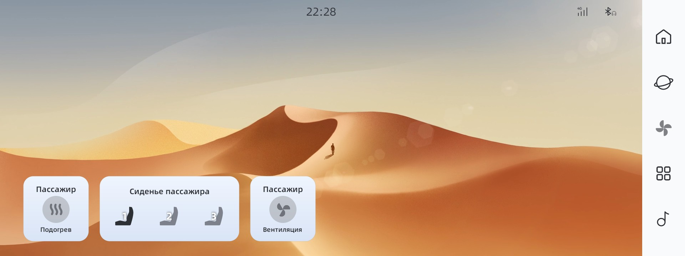
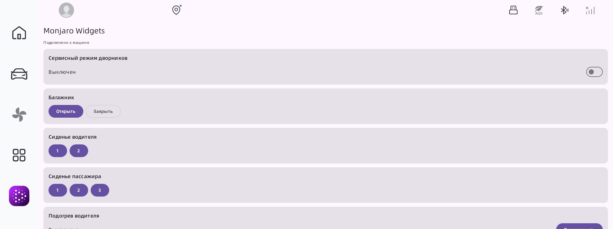
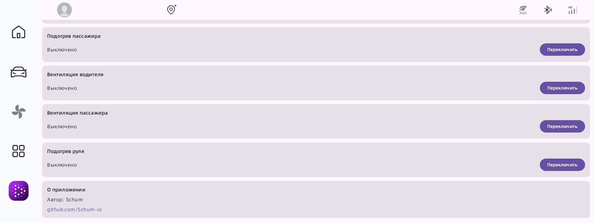

# Monjaro Widgets

[](https://github.com/Schum-io/Geely_Monjaro_Widgets/releases)
[](https://github.com/Schum-io/Geely_Monjaro_Widgets/releases)
[](https://github.com/Schum-io/Geely_Monjaro_Widgets/releases)

Набор виджетов на главный экран для **Geely Monjaro (Рестайлинг, OS 2.0+)** —
управление функциями автомобиля одним нажатием через системный API ECARX.

> [!WARNING]
> Приложение протестировано на рестайлинговой и дорестайлинговой Geely Monjaro
> с **OS 2.0**. На **Geely Monjaro SE** виджеты не работают.

> [!NOTE]
> При наличии LSPosed виджеты можно установить и на экран пассажира.

## Скриншоты

**Виджеты**

| Центральный экран | Экран пассажира |
|:---:|:---:|
|  |  |

**Экран приложения**

| Управление (1) | Управление (2) |
|:---:|:---:|
|  |  |

## Виджеты

| Виджет                           | Действие                                          |
|----------------------------------|---------------------------------------------------|
| **Сервисный режим дворников**    | Перевод дворников в сервисное положение и обратно |
| **Багажник**                     | Открыть / закрыть                                 |
| **Память сиденья водителя**      | Вызов сохранённого профиля положения — 2 профиля  |
| **Память сиденья пассажира**     | Вызов сохранённого профиля положения — 3 профиля  |
| **Подогрев сиденья водителя**    | Настраиваемый цикл уровней; по умолчанию OFF → 3 → 2 → 1 → OFF |
| **Подогрев сиденья пассажира**   | Настраиваемый цикл уровней; по умолчанию OFF → 3 → 2 → 1 → OFF |
| **Вентиляция сиденья водителя**  | Настраиваемый цикл уровней; по умолчанию OFF → 3 → 2 → 1 → OFF |
| **Вентиляция сиденья пассажира** | Настраиваемый цикл уровней; по умолчанию OFF → 3 → 2 → 1 → OFF |
| **Подогрев руля**                | Настраиваемый цикл уровней; по умолчанию OFF → 3 → 2 → 1 → OFF |
| **Уровень топлива в баке**       | Уровень в процентах и литрах                      |
| **Кнопка рециркуляции воздуха**  | Включение и выключение рециркуляции               |
| **Обогрев заднего стекла**       | Включение и выключение обогрева стекла            |

Иконки виджетов отражают текущее состояние/уровень. Состояние синхронизируется в
реальном времени: если поменять функцию через штатное меню, иконка на виджете
обновится (фоновый сервис подписан на изменения свойств машины).

В приложении есть экран-хаб, дублирующий все функции виджетов. Для подогрева и
вентиляции сидений и подогрева руля там же настраивается, какие уровни (1/2/3)
участвуют в цикле кнопки — виджет и хаб используют одну настройку.

## Установка приложения

1. Скачать APK `monjaro-widgets` из раздела [Releases](https://github.com/Schum-io/Geely_Monjaro_Widgets/releases).
2. Установить APK как системное приложение через root-проводник.
3. Добавить нужные виджеты на главный экран через стандартное меню виджетов
   (долгое нажатие на главном экране → виджеты → Monjaro Widgets).
4. Нажатие на виджет выполняет действие; иконка показывает состояние.

## Экран пассажира (LSPosed-модуль)

По умолчанию виджеты можно разместить только на главном экране (водителя).
Системный лаунчер `oneOS_Launcher3` фильтрует виджеты пассажирского экрана по
жёстко зашитому whitelist, поэтому добавить туда сторонний виджет штатно нельзя.

Модуль **`psd-widget-module`** (Xposed/LSPosed) обходит это: хукает
`XMLParseUtils.getWidgetWhiteList` лаунчера и добавляет в список пассажирского
экрана наши виджеты — **память, подогрев и вентиляцию сиденья пассажира**.

### Установка модуля
Требуется root и установленный **LSPosed** (в прошивке GMC 2.0 присутствуют Magisk и LSPosed).

1. Скачать APK `psd-widget-module` из раздела [Releases](https://github.com/Schum-io/Geely_Monjaro_Widgets/releases) и установить его.
2. Открыть **LSPosed Manager** → Модули → включить «Monjaro PSD Widgets».
3. В области действия (scope) модуля отметить лаунчер **`oneOS_Launcher3`**
   (пакет `com.android.launcher3`).
4. Перезагрузить Головное Устройство.
5. На экране пассажира открыть меню виджетов — появятся пассажирские виджеты.

## Архитектура

- `:glycar-api` — stub ECARX API (`com.ecarx.xui.adaptapi.*`), подключается
  `compileOnly`; реальная реализация даётся системой машины в рантайме.
- `com.geely.os.car.GlyCar` — мост к API: чтение/запись свойств, статус функции
  и подписка на изменения.
- `core/` — общие базы и логика:
  - `CarCommand` — единый путь команд: повторы до подтверждения машиной и чтение
    через живое соединение сервиса;
  - `ToggleCarWidgetProvider` (переключатели), `CycleLevelWidgetProvider` (циклы уровней);
  - `CarProperties` — id свойств/зон/значений и разбор их кодировки;
  - `ModeConfig` — настройка уровней, участвующих в цикле.
- `service/CarStateService` — foreground-сервис: держит соединение с машиной,
  подписан на свойства и сенсоры, ретранслирует клики виджетов.
- `widget/` — конкретные виджеты (wipers, trunk, seat, climate, fuel).

## Сборка

Для сборки нужны JDK 21 и Android SDK 36.1. Запуск unit-тестов:

```shell
./gradlew test
```
